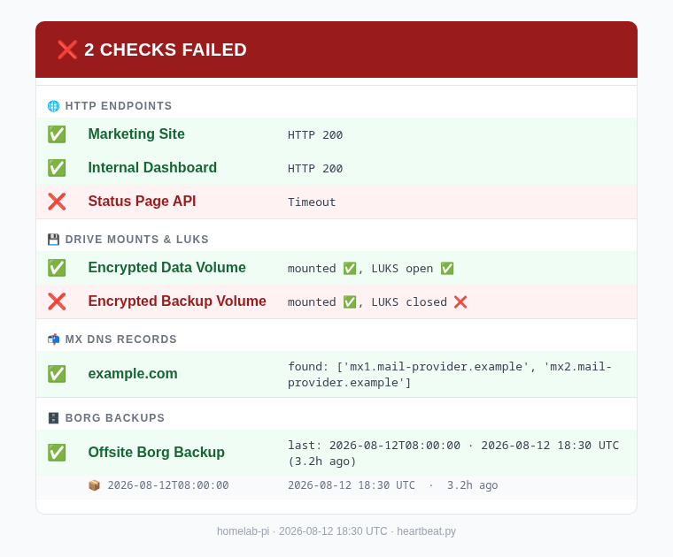

# heartbeat

**Checks the outages nobody notices.**

[](https://github.com/LeonardSchwier/heartbeat/actions/workflows/ci.yml)
[](LICENSE)
[](pyproject.toml)

<p align="center">
  
</p>

*(Sample data - generated with `--dry-run`, not a real deployment.)*

heartbeat is not an uptime monitor. If you want a dashboard with a nice UI
that pings your services every few seconds, use
[Uptime Kuma](https://github.com/louislam/uptime-kuma) - it's excellent at
that, and 300 lines of Python won't beat it.

heartbeat exists for the failure modes that stay green in every dashboard
you already run:

- **Your MX record breaks.** Every monitoring tool that alerts you by email
  just went silent, and every one of them keeps reporting green, because
  none of them checks whether mail can still reach you. This is the check
  that matters most in this repo.
- **A LUKS-encrypted drive is mounted but not actually unlocked**, or gets
  unmounted after a reboot nobody watched.
- **Your Borg backup archive quietly stopped updating.** The last successful
  run was three weeks ago and nothing told you.
- Plain old HTTP endpoints returning something other than 200, because
  that baseline still matters too.

It runs twice a day from cron or a systemd timer, checks all of the above,
and sends you one summary email. No server, no database, no Docker image,
no account to create.

> Uptime Kuma is 400 MB of Docker. This is one Python file and one cron line.

## Features

| Check | What it catches |
|---|---|
| HTTP endpoints | Non-200 responses, timeouts, connection errors. Per-check TLS verification toggle for internal self-signed endpoints. |
| LUKS drives | Mount point not mounted, or mounted but the LUKS mapper device isn't open. |
| MX DNS records | Your mail routing silently drifting or disappearing - the check every other monitor skips because it assumes its own alerting path works. |
| Borg backups | Last archive older than a configurable threshold. Deliberately skips full repo integrity checks (`borg check`), which can take hours on large repos - run that separately on its own schedule. |

Every run produces:
- One HTML + plain-text email, color-coded by check, emoji status in the subject line
- A local log file (or stdout, if the log path isn't writable)
- A non-zero exit code when anything failed, for easy cron/systemd alerting on top

## How it compares

| | **heartbeat** | Uptime Kuma | Healthchecks.io |
|---|---|---|---|
| Setup | 1 script + config + cron/systemd | Docker container, web UI, database | Hosted SaaS, or a self-hosted Django app |
| Checks | HTTP, LUKS drives, MX DNS, Borg backup freshness | HTTP/TCP/ping, with a live dashboard | "Did my job check in on time" (dead man's switch) |
| MX / mail-routing check | Yes - the check that matters most here | No | No |
| Alerting path | One email per run, independent of the service it's monitoring | Dashboard + notification integrations | Email/webhook when a check fails to ping in |
| Moving parts | None (stateless, cron-driven) | Container, database, web server | None if hosted; a web app if self-hosted |

Use them together, not instead of each other. Uptime Kuma and Healthchecks.io
are built to watch whether a service *responds*. heartbeat is built to watch
whether the things underneath that assumption still hold: whether your
alerting can actually reach you, whether your encrypted storage is actually
unlocked, and whether your backups are actually still running.

## Quickstart

```bash
git clone https://github.com/LeonardSchwier/heartbeat.git
cd heartbeat
python3 -m venv .venv && source .venv/bin/activate
pip install -r requirements.txt

cp checks.example.yml checks.yml
$EDITOR checks.yml   # add your real endpoints, drives, MX records, backup repo

export HEARTBEAT_SMTP_HOST=smtp.example.com
export HEARTBEAT_SMTP_USER=heartbeat@example.com
export HEARTBEAT_SMTP_PASSWORD=your-app-password
export HEARTBEAT_SMTP_FROM=heartbeat@example.com
export HEARTBEAT_SMTP_TO=you@example.com

python3 heartbeat.py --checks checks.yml --dry-run   # prints the report, sends nothing
python3 heartbeat.py --checks checks.yml              # sends the real email
```

Then schedule it - see [examples/](examples/) for a systemd timer or a
crontab line, both set up for twice-daily runs.

## Configuration

Configuration is split into two files, both external to the script and both
kept out of version control:

| File | Contains | Template |
|---|---|---|
| `checks.yml` | Endpoints, drives, MX records, backup repo - structural, no secrets | [`checks.example.yml`](checks.example.yml) |
| Environment variables (preferred), or `heartbeat.conf` | SMTP + Borg credentials | [`examples/heartbeat.env.example`](examples/heartbeat.env.example), [`heartbeat.conf.example`](heartbeat.conf.example) |

Credentials resolve in this order: `HEARTBEAT_SMTP_*` environment variables
first, then the INI file at `HEARTBEAT_CONF` (default
`/etc/heartbeat/heartbeat.conf`) as a fallback. Nothing is ever hardcoded in
`heartbeat.py` - every example in this repo uses `example.com` and
documentation-block IP ranges, not real infrastructure.

Relevant environment variables:

| Variable | Required | Purpose | Default |
|---|---|---|---|
| `HEARTBEAT_CHECKS` | no | Path to the checks YAML file | `/etc/heartbeat/checks.yml` |
| `HEARTBEAT_CONF` | no | Path to the credentials INI fallback | `/etc/heartbeat/heartbeat.conf` |
| `HEARTBEAT_LOG` | no | Path to the log file | `/var/log/heartbeat.log` |
| `HEARTBEAT_SMTP_HOST` | yes* | SMTP server hostname | - |
| `HEARTBEAT_SMTP_USER` | yes* | SMTP login | - |
| `HEARTBEAT_SMTP_PASSWORD` | yes* | SMTP password or app password | - |
| `HEARTBEAT_SMTP_FROM` | yes* | From address | - |
| `HEARTBEAT_SMTP_TO` | yes* | Recipient address(es), comma-separated | - |
| `HEARTBEAT_SMTP_PORT` | no | SMTP port | `587` |
| `HEARTBEAT_BORG_PASSPHRASE` | no (only if Borg check is configured) | Borg repo passphrase | - |

\* Required only if you're using environment variables for credentials; all
of these can instead come from `heartbeat.conf` (see above).

CLI flags (`--checks`, `--conf`, `--log-file`, `--dry-run`, `--version`)
override the corresponding paths for a single run - see `python3 heartbeat.py --help`.

## Deployment

See [`examples/`](examples/) for:
- `heartbeat.service` + `heartbeat.timer` - systemd, runs twice daily
- `crontab.example` - the cron equivalent, one line
- `heartbeat.env.example` - the credentials file both of the above expect

## FAQ

**Does this need a database or persistent service?** No. It's a single
Python file, run twice a day from cron or a systemd timer. No state is
kept between runs beyond whatever your mount/Borg tooling already tracks.

**Where do credentials come from?** `HEARTBEAT_SMTP_*` environment
variables first, falling back to the INI file at `HEARTBEAT_CONF`
(default `/etc/heartbeat/heartbeat.conf`). Nothing is ever hardcoded in
`heartbeat.py`.

**Can I preview a report without sending email?**
Yes - `python3 heartbeat.py --checks checks.yml --dry-run` runs every
check, prints the plain-text report, and writes `heartbeat_preview.html`;
nothing is sent and no SMTP credentials are required.

**Does it run continuously, like a daemon?** No - it's designed to run
twice a day via cron or a systemd timer and then exit. See
[examples/](examples/) for both.

**What CLI flags are there?** `--checks`, `--conf`, `--log-file`,
`--dry-run`, `--version` - see `python3 heartbeat.py --help`.

## Development

```bash
pip install -r requirements-dev.txt
pytest -v
ruff check .
```

See [CONTRIBUTING.md](CONTRIBUTING.md) for scope notes and PR guidelines.

## Security

Please see [SECURITY.md](SECURITY.md) for how to report vulnerabilities and
notes on the trust model (this script typically runs with access to SSH
keys and backup/mount state).

## License

[MIT](LICENSE)
